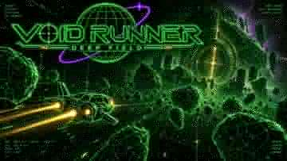

  

# VOID RUNNER

**VOID RUNNER 1.3.2 — DEEP FIELD** is a complete offline single-file 6DOF prospecting sim.

**[▶ PLAY VOID RUNNER ON ITCH.IO](https://splarg.itch.io/void-runner)**

*Read the signal. Work the seam. Go deeper into the black.*

  

Fly a wireframe survey ship through three increasingly hostile belts, resolve uncertain asteroid returns, cut marked stress nodes, haul ore/crystals/cores back to Moon Base Alpha, complete contracts, deploy salvage drones, recover planetary research and investigate rare deep-field anomalies.

## Play

### itch.io

**Play in your browser:** https://splarg.itch.io/void-runner

### Offline

Open `index.html` in a modern desktop browser with WebGL enabled. No server, install step, build system or network connection is required.

The file includes Three.js r128 under the MIT License so the game remains fully offline.

## Core loop

1. Fly into the belt and acquire an unresolved return.
2. Hold aim until the spectrometer resolves the body.
3. Cut the illuminated stress nodes rather than indiscriminately firing.
4. Manage heat, yield loss, fuel, hull and cargo signature.
5. Return to Moon Base Alpha to sell, repair, upgrade and save.
6. Buy sector access and push from Green into Yellow and Red.

## Controls

### Keyboard

- W / S — pitch
- A / D — yaw
- Q / E — roll
- Shift — thrust
- Z — afterburner
- X — brake
- Space — cut / fire
- F — dock / recover / drill
- B / N — base / waypoint
- C — rotational flight assist
- V — chase / cockpit view
- L — 3D survey lattice
- J / T — drone orders / assign scanned body
- Tab — warp (once installed)
- P / Esc — pause; emergency tow is available from pause
- M — sound

Standard gamepads are supported.

## 1.3.2 — DEEP FIELD

This maintenance release keeps 1.3.1's prospecting-first design and tightens four edge cases:

- Colossus cooldown and per-sortie lock now commit only when the contact actually materialises. Cancelling the six-second resonance wind-up no longer burns the 15-minute lock, while the surveyed ancient remains permanently examined and cannot be rerolled.
- Fuel-critical and fuel-empty guidance re-arms for each new sortie instead of disappearing forever after the first career occurrence.
- Removed the redundant Colossus discovery call from `strikeRock()`; discovery is scan-driven and extraction is extraction again.
- Death score / leaderboard entry now use the last docked checkpoint ledger and no longer include failed-sortie cargo or unbanked kills/credits.

## 1.3.1 — DEEP FIELD

1.3.1 reconciled the unfinished combat layer with the survey game:

- Rare Red-sector ancient scans can produce a stable, seeded Void Colossus response with a two-stage six-second telegraph.
- Generic timed pirate waves and their dead UI/achievement were removed.
- Death now restores the last docked checkpoint in memory rather than reloading to the title screen.
- Empty fuel teaches the emergency tow path.
- God mode is hidden behind `DEBUG = false`.
- Legacy/dead state from earlier experimental systems was removed.
- New-run reset and pause/gamepad handling were tightened.

## 1.3 — SPACE & FLIGHT

- True volumetric sector formations instead of a flat asteroid belt.
- Torque-based 6DOF rotation with meaningful flight-assist on/off behaviour.
- Acceleration-sensitive spring chase camera and dynamic FOV.
- Near/mid spatial particles and velocity streaks for parallax and speed.
- Local 500 m 3D survey lattice.
- Three-axis asteroid tumble and stronger sector identity.

## Save model

The game writes docked checkpoints to browser `localStorage`. Survey state, worked/depleted bodies, contracts, upgrades, sector access and planetary bores are restored from the checkpoint. Deep-field discovery history is kept separately so a failed sortie cannot be used to reroll the same ancient signal.

Starting a new run replaces the docked checkpoint but does not erase high scores or earned achievements.

## Design intent

VOID RUNNER is a prospecting game first. Combat is occasional consequence and spectacle, not the main progression loop. The important late-game question is meant to be:

> What is that signal?

rather than how many enemies can be spawned.

## Release artwork

The logo and key art used for the itch.io release are stored in `assets/`.

## Third-party license

Three.js r128 is bundled inside `index.html` and retains its MIT license and copyright notice. No additional external assets or libraries are required.
